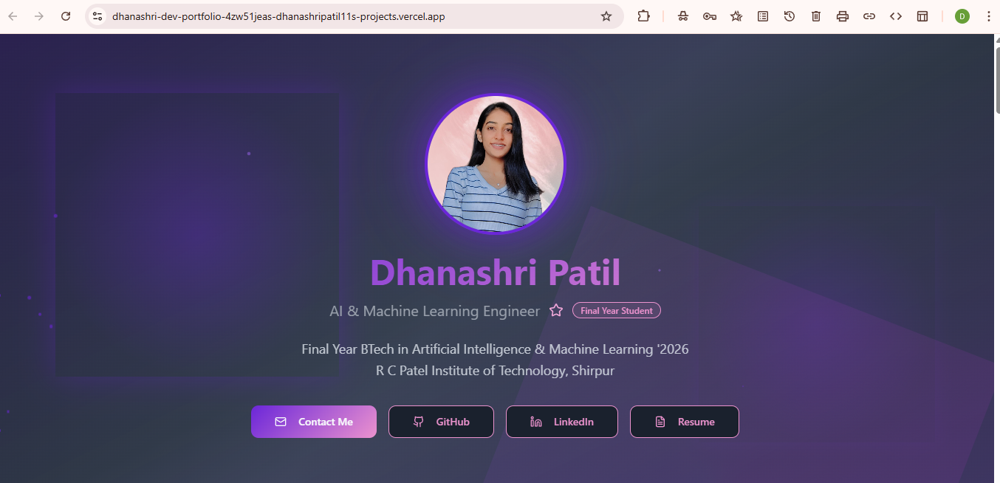
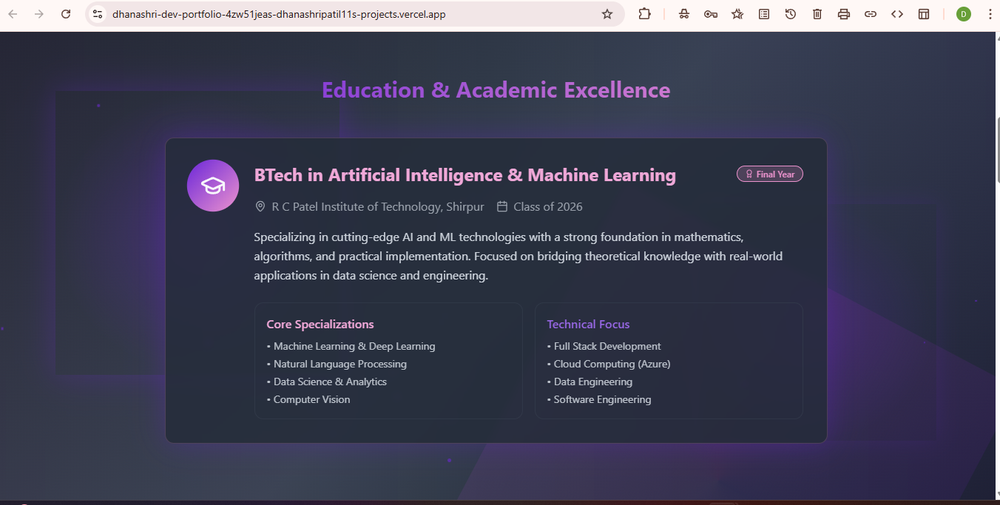
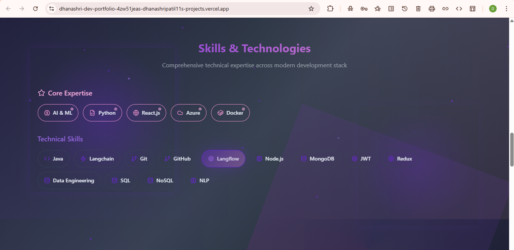
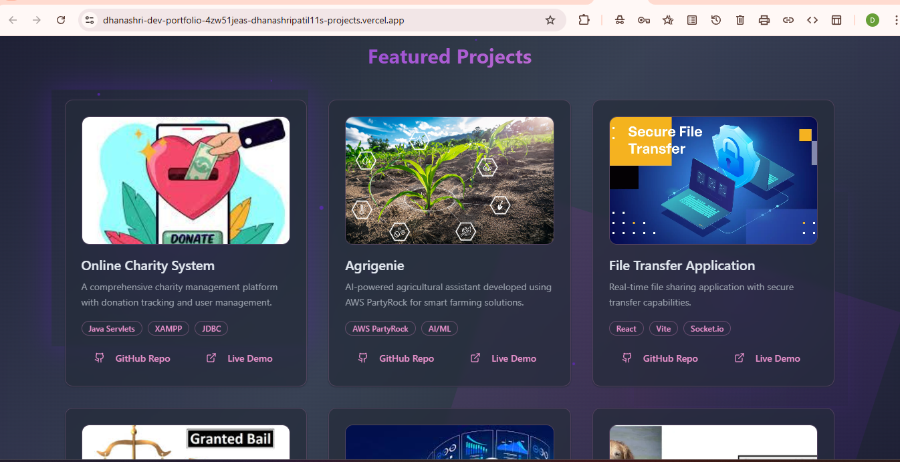
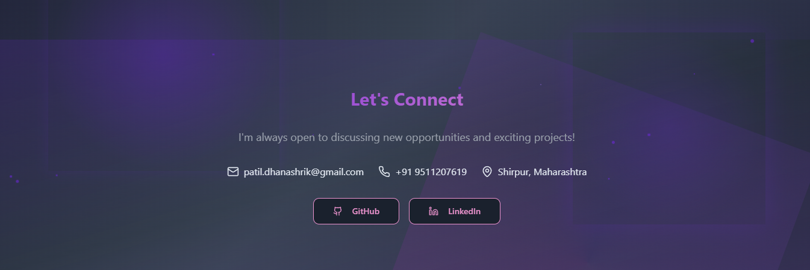

# Dhanashri's Developer Portfolio

Welcome to my personal developer portfolio! 🚀  
Showcasing my journey, skills, and projects as a passionate software engineer.

---

## 👩‍💻 About Me

Hi! I'm **Dhanashri Patil**, a dedicated developer focused on building impactful web applications and continuously learning new technologies. This portfolio highlights my technical expertise, creative projects, and professional growth.

---

## 🌟 Features

- **Modern, Responsive Design:** Optimized for all devices.
- **Project Gallery:** Explore my best projects with live demos and source code links.
- **Contact Section:** Get in touch for collaborations or opportunities.
- **Simple Navigation:** Clean UI for easy exploration.

---

## 🛠️ Tech Stack

> **Note:** The tech stack below is intentionally preserved as per your request.

<div align="center">

<table>
  <tr>
    <td align="center">
      <br/>React
    </td>
    <td align="center">
      <br/>JavaScript
    </td>
    <td align="center">
      <br/>HTML5
    </td>
    <td align="center">
      <br/>CSS3
    </td>
    <td align="center">
      <br/>Bootstrap
    </td>
    <td align="center">
      <br/>Sass/SCSS
    </td>
    <td align="center">
      <br/>Node.js
    </td>
    <td align="center">
      <br/>Git
    </td>
    <td align="center">
      <br/>GitHub
    </td>
  </tr>
</table>
</div>

---

## 📂 Project Structure

```
dhanashri-dev-portfolio/
├── public/
│   └── ...
├── src/
│   ├── assets/
│   ├── components/
│   ├── pages/
│   └── App.js
├── package.json
└── README.md
```

---

## 🚀 Getting Started

1. **Clone the repository**
   ```bash
   git clone https://github.com/DhanashriPatil11/dhanashri-dev-portfolio.git
   ```
2. **Install dependencies**
   ```bash
   npm install
   ```
3. **Start the development server**
   ```bash
   npm start
   ```
4. Open [http://localhost:3000](http://localhost:3000) to view in your browser.

---

## 📸 Screenshots

Here are some screenshots of the portfolio:

| Home Page | Projects Page | Contact Page |
|-----------|---------------|--------------|
|  | <br><br>|  |

> _You can add more screenshots by uploading images to the `screenshots` folder in your repository and updating these links._

---

## 📬 Contact

- **Email:** patil.dhanashrik@gmail.com
- **LinkedIn:** [Dhanashri Patil](https://linkedin.com/in/dhanashri-patil11)
- **GitHub:** [DhanashriPatil11](https://github.com/DhanashriPatil11)

---

## ⭐ Acknowledgements

- Thanks to the open source community for inspiration and resources.
- Special mention to all collaborators and supporters!

---

## 📄 License

This project is licensed under the MIT License.  
Feel free to use, share, and contribute!

---

> *Made with ❤️ by Dhanashri Patil*
